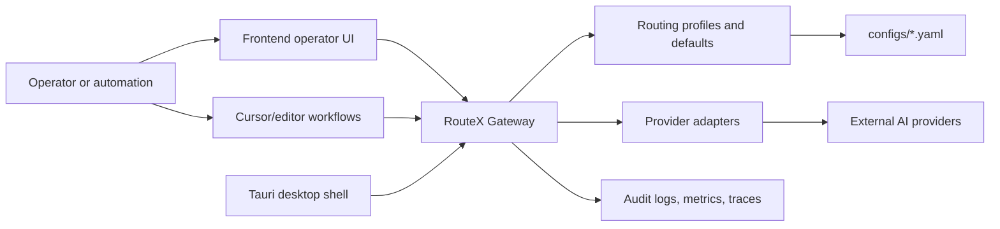

# Architecture Overview

RouteX is structured as a control plane that keeps provider-routing policy outside of product-specific code. Runtime surfaces consume a shared set of declarative contracts and operational conventions.

## System View

## Bounded Areas

### Backend

`backend/src/routex_gateway` is reserved for the control-plane service:

- public and admin APIs
- routing and provider selection
- security and secret-aware request handling
- storage and observability adapters

### Frontend

`frontend/src` will host the operator experience for:

- editing RouteX configuration safely
- visualizing route decisions and provider health
- exposing workflows to inspect failures and policy outcomes

### Desktop

`src-tauri` will package a local-first operator shell:

- environment switching
- desktop-native distribution
- workspace-aware operations for contributors and operators

### Shared Operational Layer

`configs`, `docs`, `examples`, `scripts`, `tests`, and `tooling` define the shared contract between those surfaces. This layer is intentionally implementation-light and collaboration-heavy.

## Design Goals

- keep routing rules auditable and versioned
- support multiple providers without leaking provider-specific behavior into every caller
- validate configuration locally before runtime adoption
- let backend, frontend, and desktop work in parallel against the same declared contracts

## Current Gaps

The runtime code is not yet bound to these documents. Integration work still needs to:

- load schemas at startup or mirror them into runtime validators
- align API payloads to the YAML contract shapes
- implement the provider adapter interfaces described in `docs/providers/provider-model.md`
